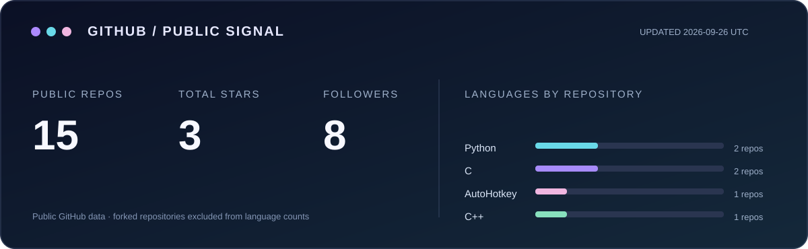

<h3 align="center">你好，我是浮枕。也可以叫我 Miguel。</h3>

从网卡的数据路径，到每天顺手用的小工具，我喜欢把问题拆开、跑通，再留下能复现的记录。

<a href="https://universesaurora.top">个人网站</a> · <a href="https://github.com/UniversesAurora?tab=repositories">项目列表</a> · <a href="https://twitter.com/universesaurora">X / Twitter</a>

### 目前在折腾

- **RDMA / RoCE**：读驱动、`rdma-core` 和 provider 的实现；用 `perftest` 看带宽、时延，以及 QP、MTU、NUMA 带来的变化。
- **Linux 与开发环境**：内核模块、clangd、WSL、虚拟机。遇到难复现的问题，就把步骤和边界条件写清楚。
- **趁手的小工具**：输入法切换、浏览器体验、电子书整理。能少做一次重复操作，就值得写点代码。

### 写过的东西

| 项目 | 做什么 |
| --- | --- |
| [KeyPersona](https://github.com/UniversesAurora/KeyPersona) | 在 Windows 按窗口记住并切换输入法。 |
| [VBoxDBGDB](https://github.com/UniversesAurora/VBoxDBGDB) | 通过 GDB remote stub 调试 VirtualBox。 |
| [yamibo-epub-scraper](https://github.com/UniversesAurora/yamibo-epub-scraper) | 把论坛小说整理成 EPUB。 |
| [浮枕星海](https://github.com/UniversesAurora/universesaurora-blog) | 个人博客与笔记。 |

<h3 align="center">在 GitHub 上</h3>

概览由本仓库的 GitHub Actions 每天更新；连续贡献图由外部服务提供。

